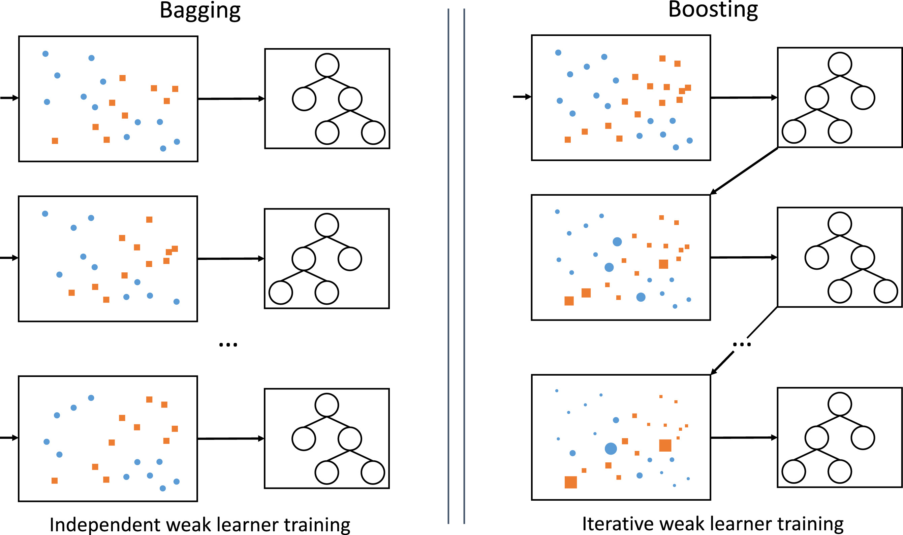

<div align="center"> 

# Simple decision trees and ensembles in Python


</div>

This repository provides a simple `numpy` implementation of CART-based decision trees and some ensemble methods (bagging w/ random forests, boosting w/ AdaBoost). Refer to [1] for a description of the implemented models. The code illustrates that, given a dataset, a decision tree can be grown and subsequently pruned (minimal cost-complexity pruning) with a simple **depth-first** algorithm [2]. To improve prediction performance, several trees can be aggregated in an ensemble, through bagging or boosting. See the notebook `demo.ipynb` for an overview of the implemented models.



[[image source]](https://doi.org/10.1016/j.inffus.2020.07.007)

## Requirements

The source code uses Python >= 3.9 with `numpy` as the sole dependency. The package can be installed with:
```
pip install -e .
```

To run the notebooks, the following packages are additionally required:
```
pip install notebook scikit-learn matplotlib
```

## Disclaimer

Note that the goal of this repo is educational, so the focus is on readability and simplicity, rather than efficiency and performance! Also note that a **best-first** algorithm for growing decision trees is sometimes preferred as it enables early stopping.

## References

[1] Hastie, T., et al. "The Elements of Statistical Learning: Data Mining, Inference, and Prediction." New York: Springer, 2009

[2] Cormen, T. H., et al. "Introduction to Algorithms." MIT press, 2022